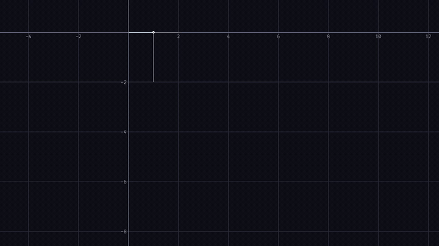

[](https://github.com/chrisi5700/geng/actions/workflows/ci.yaml)
[](https://coveralls.io/repos/github/chrisi5700/geng?branch=main)

# geng

A 2D line-plotting library for modern C++ (C++23), rendered on the GPU through Vulkan.

You build a `Figure` — a set of named line series with a view and a theme — and render it
anywhere: straight to a PNG with no window, into a GLFW window with interactive pan/zoom, or into
a Vulkan surface your application already owns (e.g. Qt's `QVulkanWindow`). The core library is
surface-agnostic; the windowing layer is optional.



> Each frame is a `Figure` rendered headless to a PNG and stitched into the clip above — the
> [`circle_video`](examples/circle_video.cpp) example ([full-quality mp4](media/circle.mp4)). Note
> the round circle: framing is aspect-corrected, so geometry never stretches with the output size.

---

## Why geng

- **Render anywhere, same figure.** One `Figure` writes a PNG today and drives a live window or an
  embedded Qt frame tomorrow — the target is chosen per render call, not at construction.
- **Handle-based series, built for streaming.** Add a series once and get a stable `SeriesId`;
  `append()` new points or `set_data()` without re-uploading the whole plot. Ideal for live signals.
- **Only redraws when something changed.** The scene is reactive: `needs_redraw()` lets a host skip
  frames entirely, and `render_into()` reports `IDLED` when the data, view, and theme are untouched.
- **Sensible defaults, full control.** Pick a series color or let the theme palette cycle one;
  `Theme::dark()` / `Theme::light()` out of the box, with grid, axes, tick labels, and per-series
  width / dash / visibility all themeable.
- **Pixel-stable styling.** Line widths are specified in screen pixels and stay constant across
  resizes and zoom.
- **Interactive view, or automatic.** Pan, zoom-to-cursor, and fit-to-data are one call each;
  `autoscale(Fit::ALL)` reframes as data arrives and `Fit::FOLLOW_LATEST` keeps a sliding window on
  the newest points.
- **No exceptions across the API.** Fallible calls return `std::expected`; the types are move-only
  and RAII-managed.

---

## A first plot

Render two series to a PNG — no window, no device setup:

```cpp
#include <geng/Figure.hpp>
#include <glm/vec2.hpp>
#include <vector>

int main()
{
    auto built = geng::Figure::offscreen();      // headless device; std::expected
    if (!built) return 1;
    geng::Figure figure = std::move(*built);

    const geng::SeriesId sine = figure.add_line("sin");                       // palette color
    figure.set_data(sine, /* std::vector<glm::vec2> */ samples);

    const geng::SeriesId ring =
        figure.add_line("circle", {.color = glm::vec4{0.3F, 0.85F, 0.45F, 1.0F}});
    figure.set_data(ring, circle_points);

    figure.autoscale(geng::Fit::ALL);            // frame all data, aspect-corrected
    return figure.render_png(1280, 720, "plot.png") ? 0 : 1;
}
```

Want a window instead? Swap the back end, keep the figure API:

```cpp
#include <geng/WindowApp.hpp>

auto app = geng::WindowApp::create({.title = "live"});
if (!app) return 1;

geng::Figure& figure = app->figure();            // same API as above
const geng::SeriesId signal = figure.add_line("signal");
figure.autoscale(geng::Fit::FOLLOW_LATEST);

app->run([&](double seconds) {                   // called once per frame
    figure.append(signal, next_samples(seconds));
});
// scroll to zoom, drag to pan — wired by default via the Interactor
```

The full surface lives behind one umbrella header, `#include <geng/geng.hpp>`. See the
[`examples/`](examples) directory for headless (`figure_png`, `circle_video`) and windowed
(`growing_sine`, `lissajous`, `live_signals`, `function_explorer`) programs.

---

## Using geng in your project

geng builds with CMake and resolves its dependencies through [vcpkg](https://vcpkg.io). The Vulkan
renderer ([veng](libs/veng)) is a git submodule.

```sh
git clone --recurse-submodules https://github.com/chrisi5700/geng.git
cd geng
cmake --preset release-vcpkg
cmake --build --preset release-vcpkg -j 4
```

After `cmake --install`, consume it from another CMake project with `find_package`:

```cmake
find_package(geng CONFIG REQUIRED)

target_link_libraries(my_app PRIVATE geng::geng)          # core (headless / embedded)
target_link_libraries(my_app PRIVATE geng::geng-glfw)     # add this only if you want a window
```

The windowed front end is gated behind the `GENG_BUILD_WINDOW` option (on by default); a purely
headless or Qt-embedding consumer can leave it off and link only `geng::geng`.

### Requirements

- A C++23 compiler
- The Vulkan SDK / loader (a GPU with Vulkan support for rendering)
- CMake ≥ 3.28 and vcpkg
- Submodules initialized (`git submodule update --init --recursive`)

---

## API at a glance

| Concern        | Entry points |
| -------------- | ------------ |
| Create         | `Figure::offscreen()` · `Figure::embedded(host)` · `WindowApp::create(config)` |
| Series         | `add_line()` → `SeriesId`, then `append()` · `set_data()` · `set_style()` · `remove()` · `clear()` |
| View           | `pan()` · `zoom()` · `focus()` · `fit_data()` · `autoscale(Fit::ALL \| FOLLOW_LATEST)` |
| Style          | `set_theme()`, `Theme::dark()` / `Theme::light()`, per-series `LineStyle` (color, `width_px`, `dash`, `visible`) |
| Render         | `render_png(w, h, path)` · `render_into(target)` · `needs_redraw(w, h)` |
| Input          | `Interactor` — feed normalized [0,1] gestures; pre-wired to scroll-zoom / drag-pan in `WindowApp` |

All public types live in namespace `geng`.

---

## License

See [LICENSE](LICENSE).
